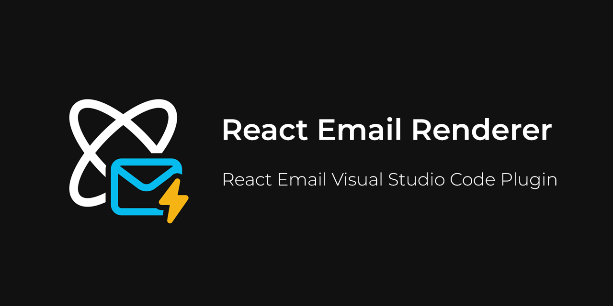

<div align="center"><strong>React Email Renderer</strong>  📧⚡</div>
<div align="center">A Visual Studio Code Extension for the React Email Package.</div>
<div align="center">
  <a href="https://react.email">Marketplace</a> 
  <span> · </span>
  <a href="https://github.com/Abdo-reda/react-email-vscode-extension">Github</a> 
  <span> · </span>
  <a href="https://react.email">React Email</a>
</div>

## Introduction

A plug & play solution to develop your react emails, shows a **live preview** without any need for any complex setup or configuration.

Instead of having to manually setup a starter project in order to view your react emails, this extension allows you to directly view/preview them in vscode. It **renders your emails behind the scenes automatically**. Allowing you to view changes in realtime, input props dynamically, view compiled code leading to faster workflows.

This is **NOT an official extension from React Email**, its more of a passion/learning project made by me `¯\_(ツ)_/¯`.

## Features

//demo video here

## Usage Notes

#### For Email Templates to be Rendered. They must abide by the following:

- The Emails must be written in **`.jsx` or `.tsx`** file extensions.
- The Email Component needs to be the **default export** of the active file.
- The Props object needs to be exported with the name **`PreviewProps`**.
  - Yes, this is unlike how react-email usually does it. I decided to make the PreviewProps object as a seperate export as it made handling things easier. _This might change in a future release_.

#### Sample Email

```tsx
import { Html } from "@react-email/components";
import * as React from "react";

interface EmailComponentProps {
  name: string;
}

export const EmailComponent = (props: EmailComponentProps) => {
  return <Html> Hello, {props.name} </Html>;
};

export default EmailComponent;

export const PreviewProps: EmailComponentProps = {
  name: "React Email",
};
```

## Why Though?

## Requirements

## Known Issues and Limitations

* Sometimes the preview panel does not refresh (blank screen). When that happens, simply click on the preview button again or run the preview command.

## Extension Settings

#### General

#### Packages

#### Server

## Extension Commands

* `preview`: **Opens and Refreshes the Preview Panel** and starts the rendering process if there are valid emails to render.

* `selectPackageVersion`: **Opens A Quick Option Dialog** to select a valid package version for react email dependencies. 

* `toggleRenderTerminal`: **Shows and Hides The Terminal**, once the terminal is shown in the UI, it can't be hidden unless the entire terminal panel is hidden.

* `restartRenderProcess`: **Restarts the Rendering Processing**. will start the rendering process if not already started.

* `stopRenderProcess`: **Stops the Rendering Processing**. will stop the rendering process if it has started.

## Contribution

All contributions are open, and all feedback is more than welcome. If you like it, please reach out and tell me. If you face any issues, do the same!

**You can send me an [email](mailto:3bdo.reda@gmail.com), leave a [review](), open an [issue](https://github.com/Abdo-reda/php-stan-vscode-extension/issues)!**

## Possible Enhancements

- [ ] Add support for deno. Make deno imports work (different import resolutions).
- [ ] Add support for Bun.
- [ ] Add support for yarn, pnpm.
- [ ] Maybe look into supporting multiple emails at once (storybook approach).
  - Will have to perform cleanup when the extension starts or disposes to delete any files in the emails folder if there is any.
- [ ] Add support for multiple projects with different dependencies (external projects) ... maybe a setting for multiple projects or a single project.
- [ ] Add support for using local dependencies instead of having to setup an external project.
- [ ] Add a custom viewer to input props (a view in the preview panel)

## LICENCE

[GNU GENERAL PUBLIC LICENSE](LICENSE)
